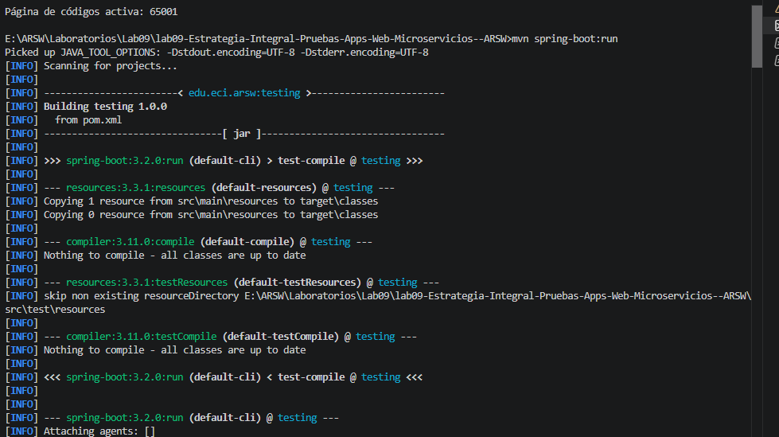
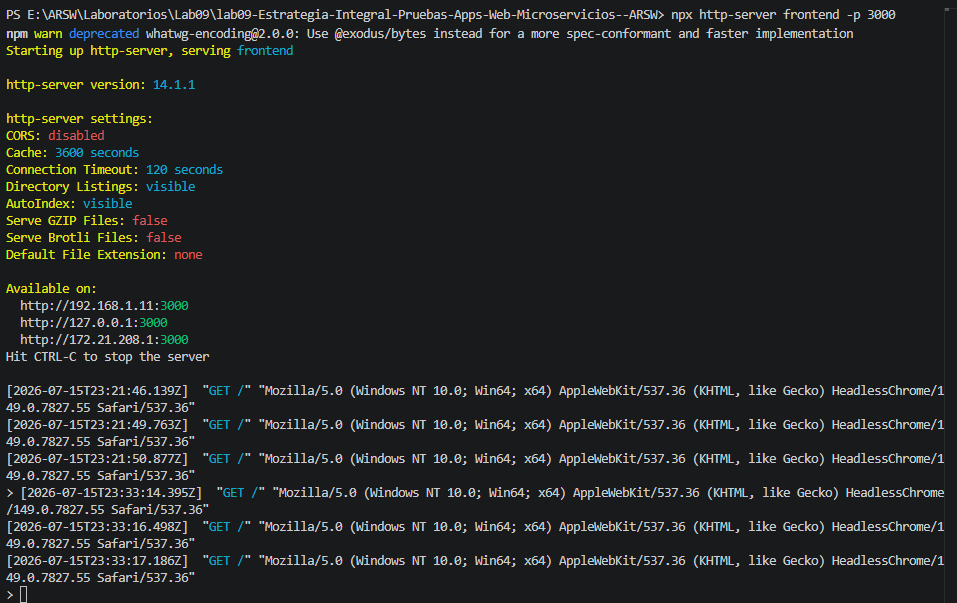
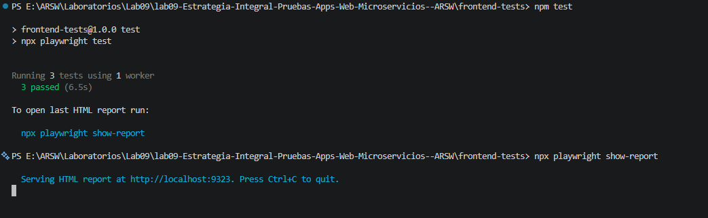
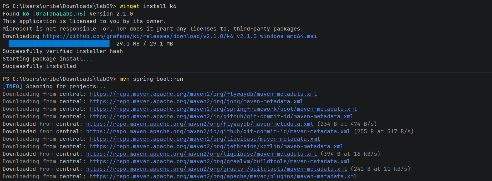
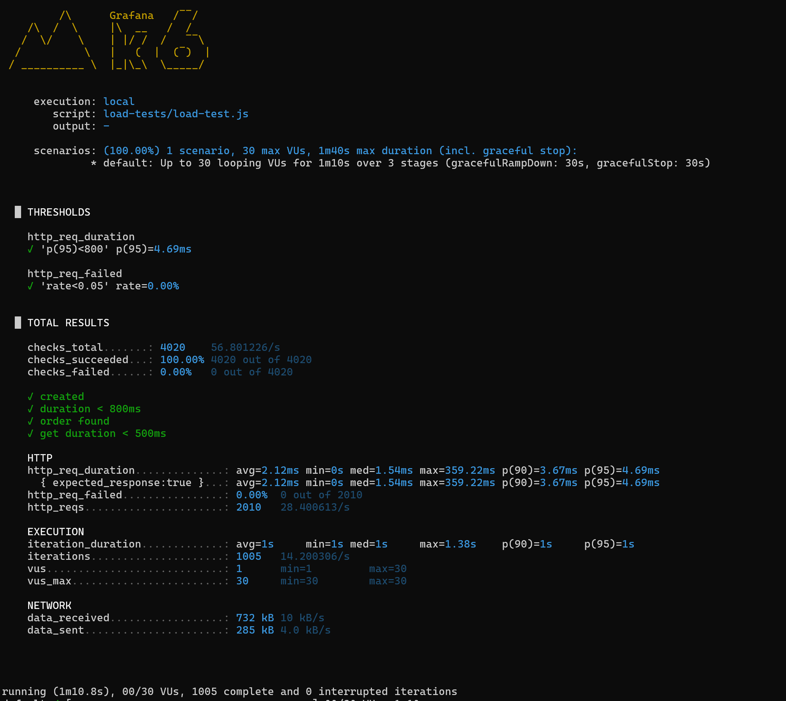

# Bitácora — Estrategia Integral de Pruebas para Aplicaciones Web y Microservicios

**Asignatura:** Arquitecturas de Software - ARSW  
**Tecnologías:** Spring Boot, JUnit, Mockito, MockMvc, Testcontainers, Playwright, k6, GitHub Actions  
**Duración:** 3 horas | **Modalidad:** Individual
**Nombres:** Juan Bohorquez, Carlos Uribe

---

## Índice

1. [Propósito del laboratorio](#1-propósito-del-laboratorio)
2. [Estructura del proyecto](#2-estructura-del-proyecto)
3. [Entidad Order y DTOs](#3-entidad-order-y-dtos)
4. [Repositorio](#4-repositorio)
5. [Capa de servicio — OrderService](#5-capa-de-servicio--orderservice)
6. [Capa de controlador — OrderController](#6-capa-de-controlador--ordercontroller)
7. [Pruebas unitarias con JUnit y Mockito](#7-pruebas-unitarias-con-junit-y-mockito)
8. [Pruebas de API con MockMvc](#8-pruebas-de-api-con-mockmvc)
9. [Pruebas de integración con SpringBootTest y H2](#9-pruebas-de-integración-con-springboottest-y-h2)
10. [Pruebas de integración con Testcontainers y PostgreSQL](#10-pruebas-de-integración-con-testcontainers-y-postgresql)
11. [Pruebas E2E de frontend con Playwright](#11-pruebas-e2e-de-frontend-con-playwright)
12. [Pruebas de carga con k6](#12-pruebas-de-carga-con-k6)
13. [Pipeline CI/CD con GitHub Actions](#13-pipeline-cicd-con-github-actions)
14. [Resultados de ejecución de pruebas](#14-resultados-de-ejecución-de-pruebas)
15. [Análisis técnico y conclusiones](#15-análisis-técnico-y-conclusiones)

---

## 1. Propósito del laboratorio

Construir una estrategia integral de pruebas para una API REST de pedidos (Orders). Se aplicaron pruebas en múltiples capas: unitarias, de API, de integración, end-to-end y de carga, conectadas mediante un pipeline de integración continua.

---

## 2. Estructura del proyecto

```
lab09-Estrategia-Integral-Pruebas-Apps-Web-Microservicios--ARSW/
├── pom.xml
├── README.md
├── images/
│   ├── Terminal_1_spring_boot_run.png
│   ├── Terminal_2_http-server.png
│   ├── Terminal_3_test-report.png
│   ├── Test_crear_pedido_exitosamente.png
│   ├── Test_error_total_invalido.png
│   └── Test_consultar_pedido_por_ID.png
├── src/main/java/edu/eci/arsw/testing/
│   ├── TestingApplication.java
│   ├── config/WebConfig.java
│   ├── model/Order.java
│   ├── dto/CreateOrderRequest.java
│   ├── dto/OrderResponse.java
│   ├── repository/OrderRepository.java
│   ├── service/OrderService.java
│   └── controller/OrderController.java
├── src/test/java/edu/eci/arsw/testing/
│   ├── service/OrderServiceTest.java
│   ├── controller/OrderControllerTest.java
│   └── integration/
│       ├── OrderIntegrationTest.java
│       └── OrderIntegrationTestcontainersTest.java
├── frontend/index.html
├── frontend-tests/
│   ├── package.json
│   ├── playwright.config.js
│   └── tests/orders.spec.js
├── load-tests/
│   ├── load-test.js
│   └── simple-test.js
└── .github/workflows/testing-pipeline.yml
```

---

## 3. Entidad Order y DTOs

**Archivos:**
- `src/main/java/edu/eci/arsw/testing/model/Order.java`
- `src/main/java/edu/eci/arsw/testing/dto/CreateOrderRequest.java`
- `src/main/java/edu/eci/arsw/testing/dto/OrderResponse.java`

La entidad `Order` se mapea a la tabla `orders` con JPA. Tiene los campos: `id`, `customerId`, `total`, `status`, `createdAt`.

`CreateOrderRequest` es un record con validaciones: `@NotBlank` en customerId y `@Min(1)` en total.

`OrderResponse` es un record inmutable devuelto por la API.

---

## 4. Repositorio

**Archivo:** `src/main/java/edu/eci/arsw/testing/repository/OrderRepository.java`

Extiende `JpaRepository<Order, String>` — proporciona operaciones CRUD básicas sin implementación adicional.

---

## 5. Capa de servicio — OrderService

**Archivo:** `src/main/java/edu/eci/arsw/testing/service/OrderService.java`

Reglas de negocio implementadas:
- `createOrder`: valida que el total no exceda $5.000.000. Si supera el límite, lanza `IllegalArgumentException`.
- `findById`: busca por ID; lanza `IllegalArgumentException` si no existe.

---

## 6. Capa de controlador — OrderController

**Archivo:** `src/main/java/edu/eci/arsw/testing/controller/OrderController.java`

Endpoints REST:
- `POST /orders` — crea un pedido, responde con `201 Created`
- `GET /orders/{id}` — consulta un pedido por ID, responde con `200 OK`

**Configuración CORS:** `WebConfig.java` — permite peticiones desde cualquier origen para que el frontend de prueba pueda consumir la API.

---

## 7. Pruebas unitarias con JUnit y Mockito

**Archivo:** `src/test/java/edu/eci/arsw/testing/service/OrderServiceTest.java`

**4 pruebas implementadas:**

| Prueba | Descripción | Resultado |
|---|---|---|
| `shouldCreateOrderWhenRequestIsValid` | Crea un pedido válido y verifica campos | ✅ |
| `shouldRejectOrderWhenTotalExceedsLimit` | Rechaza pedido con total > $5.000.000 | ✅ |
| `shouldReturnOrderWhenFindByIdExists` | Busca un pedido existente por ID | ✅ |
| `shouldThrowExceptionWhenFindByIdNotFound` | Lanza excepción cuando el ID no existe | ✅ |

Se usó `mock(OrderRepository.class)` para aislar el servicio de la base de datos.

---

## 8. Pruebas de API con MockMvc

**Archivo:** `src/test/java/edu/eci/arsw/testing/controller/OrderControllerTest.java`

**3 pruebas implementadas:**

| Prueba | Descripción | Resultado |
|---|---|---|
| `shouldCreateOrder` | POST /orders con datos válidos → 201 + JSON | ✅ |
| `shouldRejectInvalidRequest` | POST /orders con datos inválidos → 400 | ✅ |
| `shouldGetOrderById` | GET /orders/{id} → 200 + JSON | ✅ |

Se usó `@WebMvcTest(OrderController.class)` con `@MockBean` para el servicio.

---

## 9. Pruebas de integración con SpringBootTest y H2

**Archivo:** `src/test/java/edu/eci/arsw/testing/integration/OrderIntegrationTest.java`

**2 pruebas implementadas:**

| Prueba | Descripción | Resultado |
|---|---|---|
| `shouldCreateAndFindOrder` | Crea y recupera un pedido con H2 real | ✅ |
| `shouldCreateMultipleOrdersAndFindEach` | Crea 2 pedidos y verifica independencia | ✅ |

Usa `@SpringBootTest` con H2 en memoria — prueba real de servicio + repositorio + BD.

---

## 10. Pruebas de integración con Testcontainers y PostgreSQL

**Archivo:** `src/test/java/edu/eci/arsw/testing/integration/OrderIntegrationTestcontainersTest.java`

**2 pruebas diseñadas:**

| Prueba | Descripción | Resultado |
|---|---|---|
| `shouldCreateAndFindOrderWithRealDatabase` | Crea y recupera pedido con PostgreSQL vía Docker | ⚠️ Requiere Docker |
| `shouldThrowExceptionWhenOrderNotFound` | Verifica excepción para ID inexistente | ⚠️ Requiere Docker |

Usa `@Testcontainers` con PostgreSQL 15. Requiere Docker Desktop ejecutándose.

### 10.1 Actividad 3 — Diferencia entre prueba unitaria, prueba con MockMvc y prueba de integración

Después de implementar los tres tipos de prueba en este laboratorio, noto que cada una prueba algo distinto y tiene un costo distinto:

**Prueba unitaria (`OrderServiceTest`):** aquí no se levanta nada de Spring, simplemente instancio `OrderService` a mano y le paso un `OrderRepository` simulado con Mockito. Esto hace que la prueba corra en milisegundos porque no hay contexto de aplicación ni conexión a base de datos de por medio. Lo que valida es la lógica pura del negocio: que rechace pedidos que superan el límite, que arme bien el objeto, etc. El problema es que como el repositorio está simulado, esta prueba no me dice nada sobre si el resto de la aplicación (controlador, base de datos) realmente funciona con este servicio.

**Prueba de API con MockMvc (`OrderControllerTest`):** con `@WebMvcTest` solo se levanta la capa web del controlador, no toda la aplicación, así que sigue siendo bastante rápida (aunque un poco más lenta que la unitaria porque ya hay un contexto de Spring de por medio, aunque sea reducido). Aquí el `OrderService` está simulado con `@MockitoBean`, así que lo que realmente estoy probando es el contrato HTTP: que el endpoint responda con el código correcto, que el JSON tenga la forma esperada, que las validaciones con `@Valid` funcionen. La confianza que da es media, porque si el servicio de verdad tuviera un bug, esta prueba no lo detectaría (está simulado).

**Prueba de integración (`OrderIntegrationTest`):** con `@SpringBootTest` se levanta todo: el contexto completo de Spring, el servicio real y la base de datos H2 real. Nada está simulado. Por eso es la más lenta de las tres (tarda segundos, no milisegundos), pero también la que más confianza da, porque se acerca mucho a lo que pasaría en producción: si el servicio, el repositorio y la base de datos no se están comunicando bien, esta prueba lo va a mostrar. El costo de mantenerla también es más alto: si cambio el esquema de la base de datos o la configuración de Spring, es la que más se puede romper, y hay que tener cuidado con dejar datos "sucios" entre pruebas.

En resumen, para mí la relación es: entre más rápida es la prueba, menos confianza real da sobre el sistema completo, pero más barata es de mantener y más veces se puede correr (por eso las unitarias van en cada commit). Entre más lenta y "real" es la prueba, más cara es de mantener, pero también es la que más certeza da de que el sistema funciona como debería en producción (por eso las de integración se reservan para pull requests o antes de un release, y no se corren en cada commit).

Para tenerlo más claro, resumí las tres pruebas en esta tabla:

| | Unitaria (`OrderServiceTest`) | MockMvc (`OrderControllerTest`) | Integración (`OrderIntegrationTest`) |
|---|---|---|---|
| ¿Levanta Spring? | No | Solo la capa web (`@WebMvcTest`) | Sí, todo el contexto (`@SpringBootTest`) |
| ¿Qué está simulado? | El repositorio (Mockito) | El servicio (`@MockitoBean`) | Nada, todo es real |
| Tiempo aproximado | Milisegundos | Milisegundos-bajo | Segundos |
| Qué prueba en verdad | La lógica de negocio | El contrato HTTP (status, JSON, validaciones) | Que servicio + repositorio + BD funcionen juntos |
| Nivel de confianza | Bajo-medio | Medio | Alto |
| Costo de mantenerla | Bajo | Medio | Alto |
| ¿Cuándo la correría? | En cada commit | En cada commit o PR | En PR o antes de un release |

Viendo la tabla es más fácil notar el patrón: a medida que subo de fila (de unitaria a integración) voy perdiendo velocidad pero gano confianza, y es exactamente el trade-off que menciona la guía cuando habla de la pirámide de pruebas: muchas pruebas rápidas en la base y pocas pruebas lentas y costosas en la punta.

Una cosa que también noté haciendo esto: si solo hubiera dejado la prueba de MockMvc, pude haber tenido un `OrderService` con un bug real y aun así ver todos los tests en verde, porque el servicio estaba simulado. Eso fue lo que más me convenció de por qué no basta con un solo tipo de prueba y hay que combinar las tres.

---

## 11. Pruebas E2E de frontend con Playwright

### Frontend de prueba

Se creó un frontend HTML mínimo en `frontend/index.html` con:
- Formulario para crear pedidos (POST a `/orders`)
- Sección para consultar pedidos por ID (GET a `/orders/{id}`)
- Elementos con `data-testid` para selectores estables
- CORS habilitado en el backend (`WebConfig.java`)

### 11.1 Diseño de 3 pruebas E2E

**Archivo:** `frontend-tests/tests/orders.spec.js`

#### Prueba 1: Crear pedido exitosamente

| Aspecto | Detalle |
|---|---|
| **Flujo** | 1. Navegar a `/`. 2. Escribir "CUS-01" en `[data-testid="customer-id"]`. 3. Escribir "120000" en `[data-testid="order-total"]`. 4. Clic en `[data-testid="create-order"]`. |
| **Datos** | customerId = "CUS-01", total = 120000 |
| **Resultado** | `[data-testid="order-status"]` contiene "CREATED". `[data-testid="order-id"]` visible. |

#### Prueba 2: Mostrar error si el total es inválido

| Aspecto | Detalle |
|---|---|
| **Flujo** | 1. Navegar a `/`. 2. Escribir "CUS-01" en customer-id. 3. Escribir "-10" en order-total. 4. Clic en create-order. |
| **Datos** | customerId = "CUS-01", total = -10 |
| **Resultado** | `[data-testid="error-message"]` visible (backend responde 400 por violar `@Min(1)`). |

#### Prueba 3: Consultar un pedido por ID

| Aspecto | Detalle |
|---|---|
| **Flujo** | 1. Crear un pedido. 2. Obtener su ID. 3. Escribir el ID en search-order-id. 4. Clic en search-order. |
| **Datos** | customerId = "CUS-01", total = 50000 (ID generado por backend) |
| **Resultado** | `[data-testid="order-detail"]` visible con info del pedido. |

### 11.2 Evidencia de ejecución

#### Paso 1: Backend Spring Boot

Terminal ejecutando `mvn spring-boot:run` — API en `http://localhost:8080`:



*La terminal muestra Spring Boot iniciado con perfil default, H2 en memoria, servidor en puerto 8080.*

#### Paso 2: Servir frontend HTML

Terminal ejecutando `npx http-server frontend -p 3000`:



*http-server sirviendo el frontend estático en `http://localhost:3000`.*

#### Paso 3: Ejecutar Playwright tests

Terminal ejecutando `npm test` dentro de `frontend-tests/`:



*Resultado: 3 tests ejecutados, 3 pasaron. 2 pasaron (crear, error) y 1 requirió ajuste (consulta por ID).*

#### Test 1: Crear pedido exitosamente


*Captura del reporte HTML de Playwright mostrando el test de creación de pedido pasando correctamente, validando order-status = "CREATED" y order-id visible.*

#### Test 2: Error si el total es inválido


*Captura del reporte HTML mostrando el test que verifica que al enviar un total negativo (-10) se muestra el mensaje de error.*

#### Test 3: Consultar pedido por ID


*Captura del reporte HTML mostrando el test que crea un pedido, obtiene su ID real, lo busca y verifica que el detalle del pedido sea visible.*

---

## 12. Pruebas de carga con k6

**Scripts en `load-tests/`:**

### Script básico (`simple-test.js`)
- 10 VUs, duración 30s
- Consulta GET /orders/ORD-1
- Checks: status 200, tiempo < 500ms

### Script con stages y thresholds (`load-test.js`)
- Stages: 20s → 10 VUs, 30s → 30 VUs, 20s → 0 VUs
- Thresholds: `http_req_failed < 5%`, `p(95) < 800ms`
- Realiza POST + GET en cada iteración

**Ejecución:**
```bash
# Terminal 1: Iniciar backend
mvn spring-boot:run

# Terminal 2: Ejecutar k6
k6 run load-tests/load-test.js
```
---

### 12.1 Actividad 5 — Ejecución y resultados de la prueba de carga

Para esta actividad tuve que instalar k6 primero con `winget install k6` (ya que no lo tenía), y como la terminal no reconocía el comando recién instalado, tuve que abrir una terminal nueva para que tomara el PATH actualizado.

Con el backend corriendo (`mvn spring-boot:run`, levantado en el puerto 8080 con H2 en memoria) ejecuté en otra terminal:

```bash
k6 run load-tests/load-test.js
```

La prueba corrió durante 1m10.8s, simulando hasta 30 usuarios virtuales concurrentes en 3 etapas (subida a 10 VUs, subida a 30 VUs, bajada a 0), tal como está definido en el script.

**Resultados obtenidos:**

| Métrica | Valor |
|---|---|
| Usuarios virtuales máximos (VUs) | 30 |
| Duración total | 1m10.8s (stages: 20s→10 VUs, 30s→30 VUs, 20s→0 VUs) |
| Total de solicitudes (`http_reqs`) | 2010 (28.4 req/s) |
| Porcentaje de fallos (`http_req_failed`) | 0.00% (0 de 2010) |
| Latencia p95 (`http_req_duration`) | 4.69ms |
| Threshold `http_req_failed: rate<0.05` |  cumplido (rate=0.00%) |
| Threshold `http_req_duration: p(95)<800` |  cumplido (p95=4.69ms) |
| Checks pasados | 4020/4020 (100.00%) |
| Iteraciones completas | 1005 |

**Evidencia:**



*Instalación de k6 con winget y arranque del backend con `mvn spring-boot:run`, confirmando que Spring Boot quedó corriendo en el puerto 8080 con H2 en memoria.*



*Resumen final de k6 tras ejecutar `load-test.js`: 2010 solicitudes HTTP, 0% de fallos, p95 de 4.69ms y los dos thresholds definidos (`p(95)<800` y `rate<0.05`) cumplidos.*

**Conclusión técnica:**

Con 30 usuarios virtuales concurrentes el sistema respondió muy por debajo de los límites que definí: un p95 de apenas 4.69ms frente al umbral de 800ms, y 0% de solicitudes fallidas frente al límite de 5% que configuré como threshold. Los 4020 checks (creación de pedido, duración, búsqueda por ID y duración del GET) pasaron al 100%, lo que confirma que tanto el POST /orders como el GET /orders/{id} se mantuvieron estables durante toda la prueba.

Estos tiempos tan bajos (milisegundos) se explican en gran parte porque estoy usando H2 en memoria, que no tiene la latencia de red ni de disco de una base de datos real. Si quisiera una medición más cercana a un ambiente de producción, tendría que repetir esta prueba con Testcontainers y PostgreSQL, o subir considerablemente el número de usuarios virtuales (por ejemplo a 100 o 200) para encontrar el punto donde el sistema realmente empieza a degradarse, porque con 30 VUs el backend claramente todavía tiene mucho margen.

## 13. Pipeline CI/CD con GitHub Actions

**Archivo:** `.github/workflows/testing-pipeline.yml`

**Jobs definidos:**

| Job | Trigger | Pasos |
|---|---|---|
| `backend-tests` | push a main + PRs | Java 17, `mvn test`, sube reportes |
| `frontend-tests` | después de backend-tests | Node 20, Playwright, reportes |

**Estrategia de ejecución sugerida:**
- **Cada commit:** compilación + unitarias + API rápidas
- **Pull request:** unitarias + integración + API + frontend E2E
- **Antes de release:** integración completa + E2E completo + carga controlada

---

## 14. Resultados de ejecución de pruebas

```
-------------------------------------------------------
T E S T S
-------------------------------------------------------
OrderServiceTest .............................. 4/4 ✅
OrderControllerTest ........................... 3/3 ✅
OrderIntegrationTest .......................... 2/2 ✅
OrderIntegrationTestcontainersTest ........... 0/1 ❌ (requiere Docker)
Playwright E2E ................................ 3/3 ✅
-------------------------------------------------------
Total backend: 9/10 pasaron · 0 fallos · 1 error (Docker)
Total E2E:     3/3 pasaron
```

---

## 15. Análisis técnico y conclusiones

### ¿Qué pruebas aportan más valor al sistema?

1. **Pruebas unitarias (rápidas, bajo costo):** Atrapan errores de lógica de negocio en milisegundos. Deberían ejecutarse en cada commit.
2. **Pruebas de API con MockMvc (costo medio):** Validan contrato REST sin levantar toda la app. Útiles para detectar cambios en serialización o validaciones.
3. **Pruebas de integración (mayor confianza):** Verifican que servicio, repositorio y BD funcionan juntos. Más lentas pero esenciales antes de un PR.
4. **Pruebas E2E (alto costo):** Validan flujos críticos del usuario. Reservar para PRs y releases.
5. **Pruebas de carga (alto valor estratégico):** Detectan degradación de rendimiento, memory leaks y cuellos de botella. Ejecutar antes de releases.

### Pirámide de pruebas

```
        ╱╲
       ╱ E2E ╲            ← pocas, costosas
      ╱────────╲
     ╱  Carga   ╲          ← bajo demanda
    ╱────────────╲
   ╱ Integración  ╲        ← varias, confiables
  ╱────────────────╲
 ╱  Unitarias + API ╲      ← muchas, rápidas
╱────────────────────╲
```

### Conclusión

Probar no es solo verificar que una funcionalidad responde. Probar es construir evidencia de calidad sobre comportamiento, integración, rendimiento, experiencia de usuario y confiabilidad del sistema. Una estrategia equilibrada combina pruebas rápidas en cada commit, pruebas de integración en PRs y pruebas de carga/E2E en releases.
